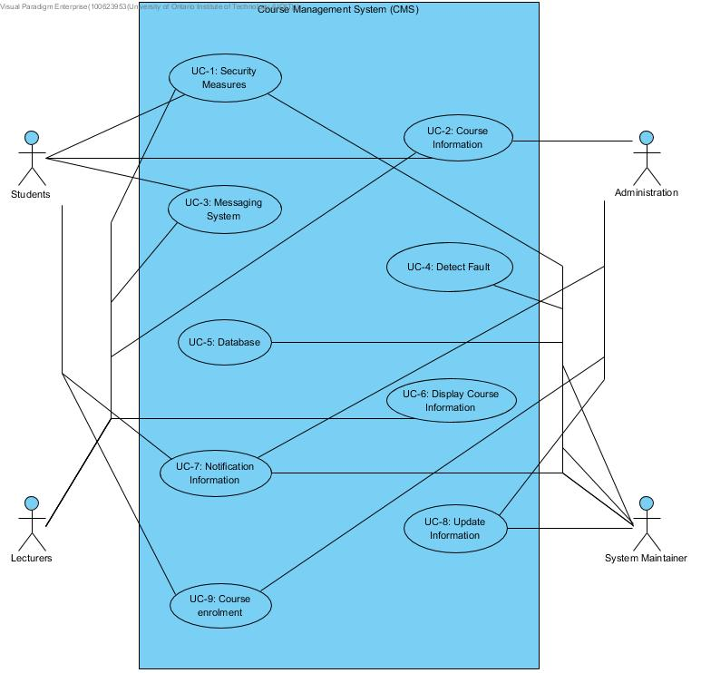

### CMS Use Case Diagram:

### Quality Attribute Scenarios:
| ID | Quality Attribute | Scenario | Associative Use Case |
| --- | --- | --- | --- |
| QA-1 | Performance | The system will perform even at peak load times. | UC-8 |
| QA-2 | Modifiability | Changes to the system can be made without having to change core components of the system. | All |
| QA-3 | Availability | If server downtime occurs, then CMS should resume within a time frame of no more than 30 minutes. | UC-4 |
| QA-4 | Usability | The system is clear to navigate and will allow for ease of access when a user requires information. | UC-9 |
| QA-5 | Security | Students, lecturers, administration, and system maintainers can make changes to the CMS with different options available depending on which 1 of the 4 users types they are. Any changes will be logged. | All |
| QA-6 | Efficiency | Notification and messaging system display information for the user and will allow for easy navigation. | UC-3, UC-7 |

### Constraints on the CMS:
| ID | Constraints |
| --- | --- |
| CON-1 | A minimum of 50 simultaneous users must be supported. |
| CON-2 | The system must be accessed through a web browser (Chrome, Firefox, Microsoft Edge) on different platforms: Windows, OSX, Linux. |
| CON-3 | An existing relational database server must be used. This server cannot be used for other purposes than hosting the database. |
| CON-4 | CMS will need to be secure while not being to restricting for users. |
| CON-5 | The network connection to user workstations can have low bandwidth but is generally reliable. |
| CON-6 | All features of the CMS must be user friendly and easily accessible. |
