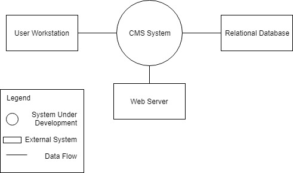

Step 1 & 2: Review inputs and select drivers

| Category                        | Details                                                                                                                                                                                                                                                   |                              |  
|---------------------------------|-----------------------------------------------------------------------------------------------------------------------------------------------------------------------------------------------------------------------------------------------------------|------------------------------|
| Design Purpose                  | This is a greenfield system from a mature domain. The purpose is to produce a sufficiently detailed design to support the construction of the system.                                                                                                     |                              |   
| Primary Functional Requirements | From the use cases presented in Part 1, the primary use cases were determined to be: UC-1 - Because it directly supports the core business UC-4 - Because it directly supports the core business UC-5 - Because it directly relates to the core structure |                              |  
| Quality Attribute Scenarios     | The scenarios were described in Table 1. They have now been prioritized as follows:                                                                                                                                                                       |                              |   
| Scenario ID                     | Importance to the customer                                                                                                                                                                                                                                | Difficulty of implementation |   
| QA-1                            | High                                                                                                                                                                                                                                                      | High                         |  
| QA-2                            | High                                                                                                                                                                                                                                                      | Medium                       |   
| QA-3                            | High                                                                                                                                                                                                                                                      | High                         |  
| QA-4                            | High                                                                                                                                                                                                                                                      | High                         |   
| QA-5                            | Medium                                                                                                                                                                                                                                                    | Medium                       |  
| QA-6                            | Medium                                                                                                                                                                                                                                                    | Low                          |   
| Constraints                     | All of the constraints outlined in Table 2 are included as drivers.                                                                                                                                                                                       |                              |   |   |   |   |   |   |   |   |   |   |   |   |   |   |   |   |   |   |   |   |

From this list, QA-1, QA-2, QA-3, and QA-4 were selected as drivers

Step 3: Choose one or more elements to refine the system

Step 4:

| Design Decisions and Location                                                                             | Rationale                                                                                                                                                                                                                                                                                                                 |
|-----------------------------------------------------------------------------------------------------------|---------------------------------------------------------------------------------------------------------------------------------------------------------------------------------------------------------------------------------------------------------------------------------------------------------------------------|
| Logically structure the client part of the system using the Web Application reference architecture.       | The Web Application reference architecture supports the development of applications that are run in the web browser. These applications support a platform independent interface needed for usability purposes (QA-4). These types of applications run in a web browser, satisfying CON-2.                                |
| Logically structure the database part of the system using the Service Application reference architecture. | Service applications do not provide a user interface but rather expose services that are consumed by other applications (in this case the Web Application referenced above). This also allows for security measures to be based on the server rather than integrated into the user workstation, partially addressing UC-1 |
| Physically structure the application using the three tier application deployment pattern.                 | Since the system must be accessed from a web browser (CON-2) and an existing database server must also be used (CON-3), a three-tier deployment is appropriate.                                                                                                                                                           |
| Build the user interface of the client using the Swing Java framework and other Java technologies.        | The standard frameworks for building Java Web Clients ensures modifiability (QA-2) and usability (QA-4). It is also what the developers are familiar with.                                                                                                                                                                |
| Deploy the application using the Java Web Start technology.                                               | Access to the application is through a web browser (CON-2). Although this means that the application loads the code each time the user accesses the application and thus increases the bandwidth requirements, the low amount of data the application holds means the bandwidth used is still low.                        |

Step 5: Instantiate Architectural Elements, Allocate Responsibilities, and
Define Interfaces

| Design Decision and Location | Rationale                                                                                                                                                                                                                                                    |
|------------------------------|--------------------------------------------------------------------------------------------------------------------------------------------------------------------------------------------------------------------------------------------------------------|
| Remove local data sources    | There is no need to store data locally, as the network connection is generally reliable. Also, this allows for easy and straightforward control for the admin, system maintainer, and lecturers as courses and course information are managed by the school. |

Step 6: Sketch Views and Record Design Decisions

Step 7: Analysis of Current Design and Review of Iteration Goal and Achievement
of Design Purpose

| **Not Addressed** | **Partially Addressed** | **Completely Addressed** | **Design Decisions Made During the Iteration**                                                                                                                                                                                                                                              |
|-------------------|-------------------------|--------------------------|---------------------------------------------------------------------------------------------------------------------------------------------------------------------------------------------------------------------------------------------------------------------------------------------|
|                   | UC-1                    |                          | Selected reference architecture establishes the modules that will support this functionality.                                                                                                                                                                                               |
| UC-4              |                         |                          | Not addressed in this iteration                                                                                                                                                                                                                                                             |
|                   | UC-5                    |                          | Selected reference architecture establishes the modules that will support this functionality.                                                                                                                                                                                               |
| QA-1              |                         |                          | Not addressed in this iteration                                                                                                                                                                                                                                                             |
|                   | QA-2                    |                          | The selected reference architecture establishes the modules that will support this functionality. The details of this component and its interfaces have not yet been defined.                                                                                                               |
| QA-3              |                         |                          | Not addressed in this iteration.                                                                                                                                                                                                                                                            |
|                   | QA-4                    |                          | The use of the Web Application reference architecture allows for the creation of a UI that is easy to navigate for any user. Blind users are supported through in text-to-speech functionalities built into the web browser. The details of this component have not yet been fully defined. |
|                   | CON-1                   |                          | The selected reference architecture establishes the modules that will support this functionality. The details of this component and its interfaces have not yet been defined.                                                                                                               |
|                   | CON-2                   |                          | The use of the Web Application reference architecture allows access through a web browser. As the program is being coded in Java, this supports the execution under Windows, OSX, and Linux                                                                                                 |
|                   | CON-3                   |                          | This concern is partially addressed in the decomposition diagram and through the physical structure of the system. The details of this component and its interfaces have not yet been defined.                                                                                              |
| CON-4             |                         |                          | Not addressed in this iteration.                                                                                                                                                                                                                                                            |
|                   | CON-5                   |                          | This concern is partially addressed in the selected deployment plan. The details of this component and its interfaces have not yet been defined.                                                                                                                                            |
|                   | CON-6                   |                          | The selected reference architecture establishes the modules that will support this functionality. The details of this component and its interfaces have not yet been defined.                                                                                                               |
