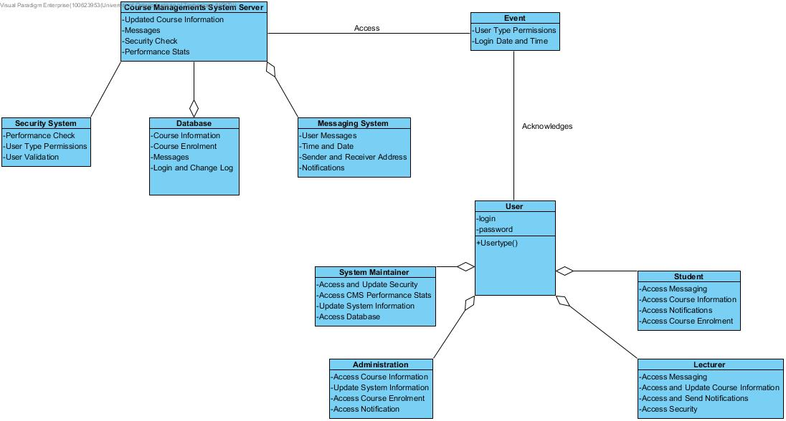
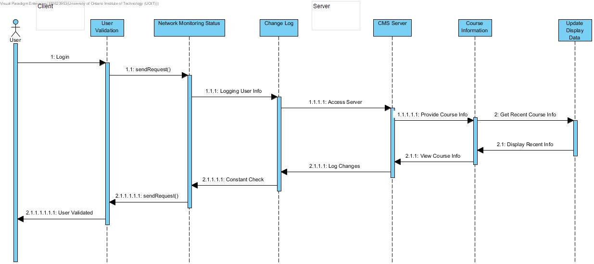
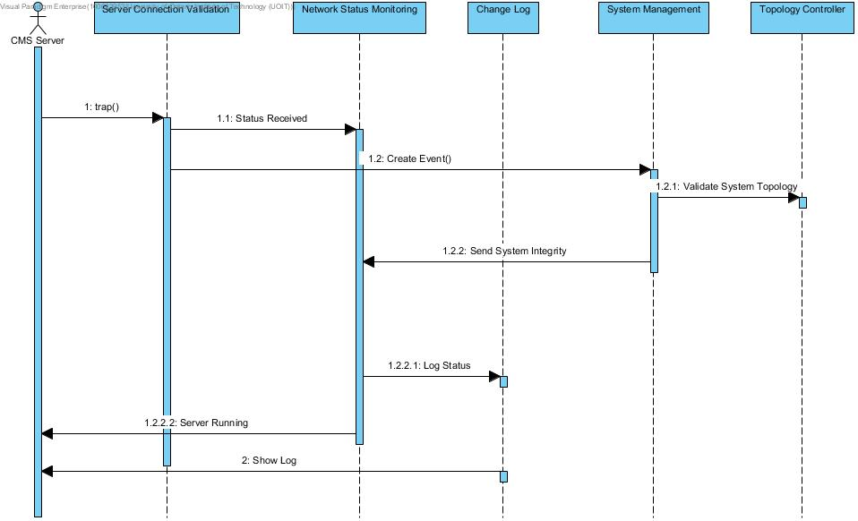
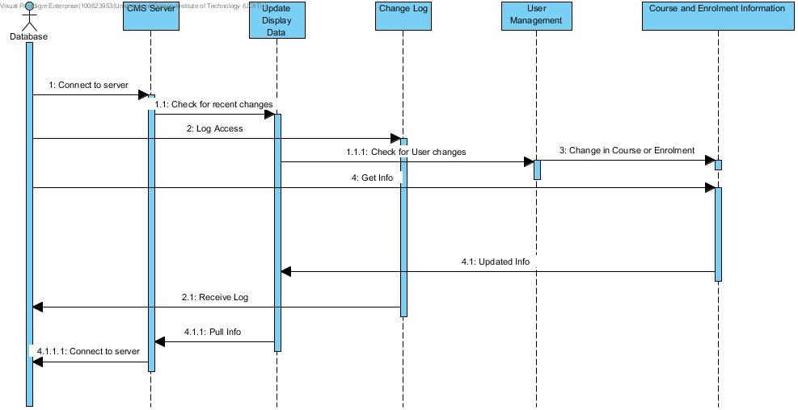

## Step 1 & 2: Establishing Iteration Goals by Selecting Drivers.
CMS primary use cases:
- UC-2: Course Information
- UC-4: Detect Fault
- UC-5: Database

## Step 3: Choose One or More Elements of the System to Refine.
(I have no clue what to write for this section)

## Step 4: Choose One or More Concepts That Satisfy the Selected Drivers.
- Domain model for the application and mapping of the functional requirements.
- Domain objects of the CMS system components.

## Step 5: Instantiate Architectural Elements, Allocate Responsibilities, and Define Interface.

  Create a domain model of the CMS. This will help determine the primary use cases needed for the architecture. Using the domain model to create domain object that will be associated with the use cases of the CMS. Having this structure will allow for an easier time of determining what component will be used for the server and client side of the system. Since the domain model and domain object are created, creating a framework of the system will be easier.

## Step 6: Sketch Views and Record Design Decisions.
### Domain model of the CMS system:

### Domain objects for the components in the CMS system:

| Element | Responsibility |
| --- | --- |
| Database Management | Contains information about courses and enrolment that is provided to the CMS server. |
| Course Management System Server | System that allows for users to navigate through course information and enrolment as well as allow for messaging with user friendly UI. |
| Update Display Data | Updated information will be send to the CMS server constantly. |
| Network Status Monitoring | Network performance and status monitoring of the CMS system and client connection. |
| Fault Detection | Provides information about issues at will affect the CMS server. |
| Change Log | Logs information about changes to the system as well as date and time of user login. |
| System Management | Allows for changes in the system to be done by system maintainers. |
| User Management | Allows for users to have access to the CMS system and be logged to maintain user validation. |
| Messaging System | Allows the user to send and receive messages and notifications to and from other users of different user types. |

### Sequence Diagram for UC-2 (Course Information):

| Status Name | Description |
| --- | --- |
| *Element:*  | *User Validation* |
| Login/User Validated | User sends login info to the element and if validated then a signal is sent back. |
| *Element:* | *Network Monitoring Status* |
| SendRequest() | Constantly send a network validation request while the user is logged into the CMS system. |
| *Element:* | *Change Log* |
| Logging User Info/Constant Check | User login and logout date and time will be stored in the log. Any changes to the system will also be logged.  |
| *Element:* | *CMS Server* |
| Access Server/Log Changes | The user will have access to the CMS server. Any changes that the user does in the CMS will be sent to the Change Log to be logged. |
| *Element:* | *Course Information* |
| Provide Course Info/View Course Info | Request for course info from the server and displaying course info to the user. |
| *Element:* | *Update Display Data* |
| Get Recent Course Info/Display Course Info | Request recent course info from server as well as displays the most recent course info. |

### Sequence Diagram for UC-4 (Detect Fault):

| Method Name | Description |
| --- | --- |
| *Element:*  | *Server Connection Validation* |
| trap() | Receive an exception to the server connection validation. Will be sent to System Management. |
| *Element:* | *Network Status Monitoring* |
| Status Received | Check if the server is still running. |
| Send System Integrity | Status of the CMS, if running. |
| *Element:* | *Change Log* |
| Log Status | Network status is being logged. |
| *Element:* | *System Management* |
| Create Event() | Trap received from the server connection validation gets turned into an event to be sent the Topology Controller. |
| *Element:* | *Course Information* |
| Provide Course Info/View Course Info | Request for course info from the server and displaying course info to the user. |
| *Element:* | *Topology Controller* |
| Validate System Topology | Receive the event then will check if the system structure is running as intended. |

### Sequence Diagram for UC-5 (Database):

| Status Name | Description |
| --- | --- |
| *Element:*  | *CMS Server* |
| Connect to server | CMS server and database connection made. |
| Pull Info | CMS server will get the most current information to display. |
| *Element:* | *Update Display Data* |
| Check for recent changes | Check for any changes that were made from the server. |
| Updated info | Updates course and enrolment data from user changes. |
| *Element:* | *Change Log* |
| Log access | Database stores log entries for viewing. |
| *Element:* | *User Management* |
| Check for user changes | Checks if user has made changes to the CMS. |
| *Element:* | *Course and Enrolment Information* |
| Change in course or enrolment | Applies changes the user has made to the course and enrolment status. |
| Get info | Gets data stored in the database for the course and enrolment information. |

## Step 7: Perform Analysis of Current Design and Review Iteration Goal and Achievement of Design Purpose.
| Not Addressed | Partially Addressed | Completely Addressed | Design Decisions Made During the Iteration |
| --- | --- | --- | ---- |
|  | UC-1, UC-3, UC-6, UC-7, UC-8, UC-9 |  | Associative use cases have been touched on but not primary focus in this iteration. |
|  |  | UC-2 | Models and diagrams to support this use case have been created. |
|  |  | UC-4 | Models and diagrams to support this use case have been created. |
|  |  | UC-5 | Models and diagrams to support this use case have been created. |
| QA-1, QA-4, QA-6 |  |  | Not addressed in this iteration. |
|  | QA-2 |  | Relates to associated use case (UC-5) which has been described in this iteration. |
|  | QA-3 |  | Relates to associated use case (UC-4) which has been described in this iteration. |
|  | QA-5 |  | Relates to associated use case (UC-1, UC-5) which has been described in this iteration. |
| CON-2, CON-4, CON-6 |  |  | Not addressed in this iteration. |
|  | CON-1 |  | Identified and modules relating to the issue have been investigated. |
|  | CON-3 |  | Identified and modules relating to the issue have been investigated. |
|  | CON-5 |  | Identified and modules relating to the issue have been investigated. |
