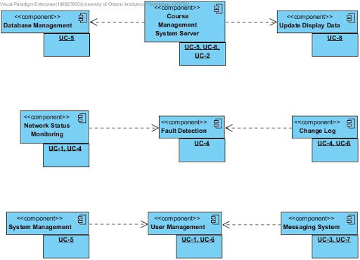

## Step 1 & 2: Establishing Iteration Goals by Selecting Drivers.
CMS primary use cases:
- UC-2: Course Information
- UC-4: Detect Fault
- UC-5: Database

## Step 3: Choose One or More Elements of the System to Refine.
(I have no clue what to write for this section)

## Step 4: Choose One or More Concepts That Satisfy the Selected Drivers.
- Domain model for the application and mapping of the functional requirements.
- Domain objects of the CMS system components.

## Step 5: Instantiate Architectural Elements, Allocate Responsibilities, and Define Interface.

  Create a domain model of the CMS. This will help determine the primary use cases needed for the architecture. Using the domain model to create domain object that will be associated with the use cases of the CMS. Having this structure will allow for an easier time of determining what component will be used for the server and client side of the system. Since the domain model and domain object are created, creating a framework of the system will be easier.

## Step 6: Sketch Views and Record Design Decisions.
Domain model of the CMS system:

Domain objects for the components in the CMS system:

| Element | Responsibility |
| --- | --- |
| Database Management | Contains information about courses and enrolment that is provided to the CMS server. |
| Course Management System Server | System that allows for users to navigate through course information and enrolment as well as allow for messaging with user friendly UI. |
| Update Display Data | Updated information will be send to the CMS server constantly. |
| Network Status Monitoring | Network performance and status monitoring of the CMS system and client connection. |
| Fault Detection | Provides information about issues at will affect the CMS server. |
| Change Log | Logs information about changes to the system as well as date and time of user login. |
| System Management | Allows for changes in the system to be done by system maintainers. |
| User Management | Allows for users to have access to the CMS system and be logged to maintain user validation. |
| Messaging System | Allows the user to send and receive messages and notifications to and from other users of different user types. |

Sequence Diagram for UC-2 (Course Information):

Sequence Diagram for UC-4 (Detect Fault):

Sequence Diagram for UC-5 (Database):

## Step 7: Perform Analysis of Current Design and Review Iteration Goal and Achievement of Design Purpose.
